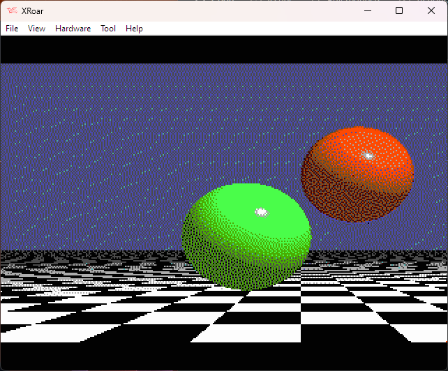

# CocoRaytrace

Porting of a [simple raytracer](https://github.com/WyattAutomation/Simple-Raytracer-in-C) on a Tandy Coco 3

# How to build
- Install [CMOC](http://perso.b2b2c.ca/~sarrazip/dev/cmoc.html)
- Adapt [COCOMakefile](./COCOMakefile)
- make -f COCOMakefile run

# Now you are on the COCO side ([XRoar](https://www.6809.org.uk/xroar/))
- LOADM "BGRAY"
- EXEC
- REM WAIT 13 hours